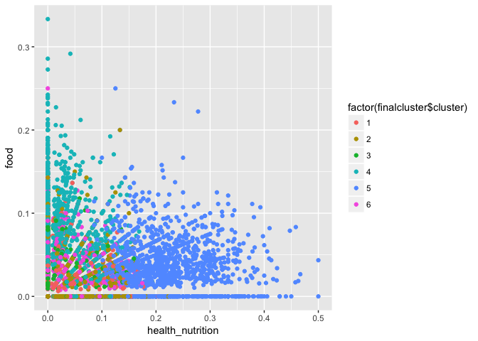

``` r
library(ggplot2)
library(LICORS)  # for kmeans++
library(foreach)
library(mosaic)
```

    ## Loading required package: dplyr

    ## 
    ## Attaching package: 'dplyr'

    ## The following objects are masked from 'package:stats':
    ## 
    ##     filter, lag

    ## The following objects are masked from 'package:base':
    ## 
    ##     intersect, setdiff, setequal, union

    ## Loading required package: lattice

    ## Loading required package: ggformula

    ## 
    ## New to ggformula?  Try the tutorials: 
    ##  learnr::run_tutorial("introduction", package = "ggformula")
    ##  learnr::run_tutorial("refining", package = "ggformula")

    ## Loading required package: mosaicData

    ## 
    ## The 'mosaic' package masks several functions from core packages in order to add 
    ## additional features.  The original behavior of these functions should not be affected by this.
    ## 
    ## Note: If you use the Matrix package, be sure to load it BEFORE loading mosaic.

    ## 
    ## Attaching package: 'mosaic'

    ## The following objects are masked from 'package:dplyr':
    ## 
    ##     count, do, tally

    ## The following objects are masked from 'package:stats':
    ## 
    ##     binom.test, cor, cor.test, cov, fivenum, IQR, median,
    ##     prop.test, quantile, sd, t.test, var

    ## The following objects are masked from 'package:base':
    ## 
    ##     max, mean, min, prod, range, sample, sum

``` r
social = read.csv('http://raw.githubusercontent.com/jgscott/STA380/master/data/social_marketing.csv', header=TRUE)
head(social[,-1],5)
```

    ##   chatter current_events travel photo_sharing uncategorized tv_film
    ## 1       2              0      2             2             2       1
    ## 2       3              3      2             1             1       1
    ## 3       6              3      4             3             1       5
    ## 4       1              5      2             2             0       1
    ## 5       5              2      0             6             1       0
    ##   sports_fandom politics food family home_and_garden music news
    ## 1             1        0    4      1               2     0    0
    ## 2             4        1    2      2               1     0    0
    ## 3             0        2    1      1               1     1    1
    ## 4             0        1    0      1               0     0    0
    ## 5             0        2    0      1               0     0    0
    ##   online_gaming shopping health_nutrition college_uni sports_playing
    ## 1             0        1               17           0              2
    ## 2             0        0                0           0              1
    ## 3             0        2                0           0              0
    ## 4             0        0                0           1              0
    ## 5             3        2                0           4              0
    ##   cooking eco computers business outdoors crafts automotive art religion
    ## 1       5   1         1        0        2      1          0   0        1
    ## 2       0   0         0        1        0      2          0   0        0
    ## 3       2   1         0        0        0      2          0   8        0
    ## 4       0   0         0        1        0      3          0   2        0
    ## 5       1   0         1        0        1      0          0   0        0
    ##   beauty parenting dating school personal_fitness fashion small_business
    ## 1      0         1      1      0               11       0              0
    ## 2      0         0      1      4                0       0              0
    ## 3      1         0      1      0                0       1              0
    ## 4      1         0      0      0                0       0              0
    ## 5      0         0      0      0                0       0              1
    ##   spam adult
    ## 1    0     0
    ## 2    0     0
    ## 3    0     0
    ## 4    0     0
    ## 5    0     0

``` r
#scale the data
X = social[,-1]
X = X/rowSums(X)
```

We decided to scale the data according to their row sums because we want all users' interests to be equally weighted regardless of their overall level of twitter usage.

Kmeans method:
==============

``` r
#test various k values
CH_list = {}
kval = c(2,4,6,10,15)
for (i in kval){
  # Using kmeans++ initialization
  cluster = kmeanspp(X, k=i, nstart=25)
  W = cluster$tot.withinss
  B = cluster$betweenss
  nk = (nrow(social)-i)/(i-1)
  val = (B/W)*nk
  CH_list = c(CH_list,val)
  cat(c(i," "))
}
```

    ## 2  4  6  10  15

``` r
#plot CH index againt k value to find best k
plot(kval,CH_list)
```


The plot of CH index against K value, we decided that the best k value is 6. The max CH value occurs when k = 2, but since our dataset is so large, it makes sense to split into more than 2 clusters. At a k value of 6, the CH index is high, but we are clustering the dtat into smaller subsets, so we chose to work with k = 6 clusters.

``` r
#run kmeans to cluster the data
set.seed(11)
finalcluster = kmeanspp(X, k=6, nstart=25)

finalcluster$size
```

    ## [1]  789 2069  610 1946 1349 1119

``` r
finalcluster$centers[1,]
```

    ##          chatter   current_events           travel    photo_sharing 
    ##     7.417585e-02     3.606297e-02     2.937761e-02     9.513109e-02 
    ##    uncategorized          tv_film    sports_fandom         politics 
    ##     2.224055e-02     1.757223e-02     1.959959e-02     1.976196e-02 
    ##             food           family  home_and_garden            music 
    ##     1.719793e-02     1.476521e-02     1.191375e-02     1.998202e-02 
    ##             news    online_gaming         shopping health_nutrition 
    ##     1.452066e-02     1.575284e-02     2.735364e-02     2.785715e-02 
    ##      college_uni   sports_playing          cooking              eco 
    ##     2.131878e-02     1.350505e-02     1.863808e-01     9.240428e-03 
    ##        computers         business         outdoors           crafts 
    ##     1.154641e-02     9.291320e-03     1.370430e-02     9.377327e-03 
    ##       automotive              art         religion           beauty 
    ##     1.322459e-02     1.499197e-02     1.383769e-02     5.994620e-02 
    ##        parenting           dating           school personal_fitness 
    ##     1.265450e-02     9.773025e-03     1.556872e-02     1.751562e-02 
    ##          fashion   small_business             spam            adult 
    ##     9.187170e-02     7.303306e-03     9.592632e-05     5.587268e-03

``` r
finalcluster$centers[3,]
```

    ##          chatter   current_events           travel    photo_sharing 
    ##     0.0794688466     0.0332905082     0.0294269734     0.0462839098 
    ##    uncategorized          tv_film    sports_fandom         politics 
    ##     0.0196575585     0.0307677418     0.0238171353     0.0204929533 
    ##             food           family  home_and_garden            music 
    ##     0.0234091570     0.0192900309     0.0117797640     0.0162322167 
    ##             news    online_gaming         shopping health_nutrition 
    ##     0.0136808572     0.1670040567     0.0185067144     0.0212915535 
    ##      college_uni   sports_playing          cooking              eco 
    ##     0.1871487294     0.0411165121     0.0211665626     0.0090174713 
    ##        computers         business         outdoors           crafts 
    ##     0.0096467863     0.0078761492     0.0112790478     0.0093338285 
    ##       automotive              art         religion           beauty 
    ##     0.0145081405     0.0191572258     0.0126651431     0.0083521223 
    ##        parenting           dating           school personal_fitness 
    ##     0.0116763789     0.0115996537     0.0094060021     0.0146445055 
    ##          fashion   small_business             spam            adult 
    ##     0.0125177502     0.0082768751     0.0001934781     0.0060176601

The largest clusters are clusters 1 and 3, so we can look at the top topics of interest in the clusters to learn about many of the followers. Cluster 1 displays an interest in photo sharing, shopping, current events, and travel. Cluster 3 shows interest in sports fandom, food, and religion. We can use this information to tailor our message in our marketing campaign.

``` r
#plot to show our target influencers
qplot(health_nutrition, food, data=X, color=factor(finalcluster$cluster))
```



After looking at the 6 clusters, we plotted the clusters against health\_nutrition and food because we determined that these are the topics that most relate to nutrientH2O. We found that groups 3 and 6 show a high level of interest in these topics, so we can find the influencers among these groups to help us campaign about NutrientH2O.

PCA method:
===========

``` r
# PCA
set.seed(12)
PC = prcomp(X, scale=TRUE)
loadings = PC$rotation
scores = PC$x


# Show the top topics associated with each component
o1 = order(loadings[,1], decreasing = TRUE)
colnames(X)[head(o1,6)]
```

    ## [1] "religion"      "sports_fandom" "parenting"     "food"         
    ## [5] "school"        "family"

``` r
colnames(X)[tail(o1,6)]
```

    ## [1] "college_uni"   "fashion"       "cooking"       "shopping"     
    ## [5] "chatter"       "photo_sharing"

``` r
o2 = order(loadings[,2], decreasing = TRUE)
colnames(X)[head(o2,6)]
```

    ## [1] "chatter"        "politics"       "travel"         "shopping"      
    ## [5] "automotive"     "current_events"

``` r
colnames(X)[tail(o2,6)]
```

    ## [1] "beauty"           "fashion"          "cooking"         
    ## [4] "outdoors"         "personal_fitness" "health_nutrition"

``` r
#plot the data on PC1 and PC2
qplot(scores[,1], scores[,2], xlab='Component 1', ylab='Component 2')
```


``` r
#plot all vectors
biplot(PC)
```


Because health\_nutrition is the lowest loading in PC2 and food is high in PC1, we want to target the users whose PC2 is low and PC1 is high. These users are plotted in the bottom region slightly to the right in the biplot shown.
