Probability Practice
--------------------

Part A.
=======

! \[Part A math\] (<https://github.com/ekrey/Homework-1-Scott/blob/master/IMG_2852.JPG>) Answer: 5/7 of all people answering the survey were truthful clickers that answered yes.

Part B.
=======

! \[Part B math\] (<https://github.com/ekrey/Homework-1-Scott/blob/master/IMG_2849.JPG>)

Answer:

-Given someone tests positive, there is a 19.9% probability that they have the disease. In implementing a universal testing policy, people being tested should be made aware that there is only a 1 in 5 chance that they have the disease given their positive test. Those showing positive test results will have to go into further testing to confirm the disease state, otherwise they may be mistakenly treated for a disease they don't have.

Exploratory Analysis: Green Buildings
=====================================

Let's start by loading in the data and doing some exploratory analysis.

``` r
green = read.csv('https://raw.githubusercontent.com/jgscott/STA380/master/data/greenbuildings.csv')
green = na.omit(green)
green_only = subset(green, green_rating == 1)
nongreen = subset(green, green_rating == 0)
library(dplyr)
```

    ## 
    ## Attaching package: 'dplyr'

    ## The following objects are masked from 'package:stats':
    ## 
    ##     filter, lag

    ## The following objects are masked from 'package:base':
    ## 
    ##     intersect, setdiff, setequal, union

``` r
head(green)
```

    ##   CS_PropertyID cluster   size empl_gr  Rent leasing_rate stories age
    ## 1        379105       1 260300    2.22 38.56        91.39      14  16
    ## 2        122151       1  67861    2.22 28.57        87.14       5  27
    ## 3        379839       1 164848    2.22 33.31        88.94      13  36
    ## 4         94614       1  93372    2.22 35.00        97.04      13  46
    ## 5        379285       1 174307    2.22 40.69        96.58      16   5
    ## 6         94765       1 231633    2.22 43.16        92.74      14  20
    ##   renovated class_a class_b LEED Energystar green_rating net amenities
    ## 1         0       1       0    0          1            1   0         1
    ## 2         0       0       1    0          0            0   0         1
    ## 3         1       0       1    0          0            0   0         1
    ## 4         1       0       1    0          0            0   0         0
    ## 5         0       1       0    0          0            0   0         1
    ## 6         0       1       0    0          0            0   0         1
    ##   cd_total_07 hd_total07 total_dd_07 Precipitation  Gas_Costs
    ## 1        4988         58        5046         42.57 0.01370000
    ## 2        4988         58        5046         42.57 0.01373149
    ## 3        4988         58        5046         42.57 0.01373149
    ## 4        4988         58        5046         42.57 0.01373149
    ## 5        4988         58        5046         42.57 0.01373149
    ## 6        4988         58        5046         42.57 0.01373149
    ##   Electricity_Costs cluster_rent
    ## 1        0.02900000        36.78
    ## 2        0.02904455        36.78
    ## 3        0.02904455        36.78
    ## 4        0.02904455        36.78
    ## 5        0.02904455        36.78
    ## 6        0.02904455        36.78

``` r
tail(green)
```

    ##      CS_PropertyID cluster    size empl_gr   Rent leasing_rate stories age
    ## 7889        664909    1230    4320    1.15 111.11         0.00       4 107
    ## 7890        157117    1230 1300000    1.15 137.51       100.00      41  35
    ## 7891        158379    1230   16140    1.15 152.73        75.22       8  90
    ## 7892         52316    1230   15726    1.15 158.92       100.00       6  67
    ## 7893        158124    1230   51300    1.15 198.99       100.00      12  91
    ## 7894        157086    1230 1876972    1.15 250.00        99.84      45  34
    ##      renovated class_a class_b LEED Energystar green_rating net amenities
    ## 7889         0       0       0    0          0            0   0         0
    ## 7890         0       1       0    0          0            0   0         0
    ## 7891         1       0       0    0          0            0   0         0
    ## 7892         0       0       0    0          0            0   0         0
    ## 7893         0       0       1    0          0            0   0         0
    ## 7894         1       1       0    0          0            0   0         1
    ##      cd_total_07 hd_total07 total_dd_07 Precipitation  Gas_Costs
    ## 7889        1299       4796        6095         48.35 0.01175716
    ## 7890        1299       4796        6095         48.35 0.01175716
    ## 7891        1299       4796        6095         48.35 0.01175716
    ## 7892        1299       4796        6095         48.35 0.01175716
    ## 7893        1299       4796        6095         48.35 0.01175716
    ## 7894        1299       4796        6095         48.35 0.01175716
    ##      Electricity_Costs cluster_rent
    ## 7889        0.04545721        58.72
    ## 7890        0.04545721        58.72
    ## 7891        0.04545721        58.72
    ## 7892        0.04545721        58.72
    ## 7893        0.04545721        58.72
    ## 7894        0.04545721        58.72

``` r
glimpse(green)
```

    ## Observations: 7,820
    ## Variables: 23
    ## $ CS_PropertyID     <int> 379105, 122151, 379839, 94614, 379285, 94765...
    ## $ cluster           <int> 1, 1, 1, 1, 1, 1, 6, 6, 6, 6, 6, 6, 6, 6, 6,...
    ## $ size              <int> 260300, 67861, 164848, 93372, 174307, 231633...
    ## $ empl_gr           <dbl> 2.22, 2.22, 2.22, 2.22, 2.22, 2.22, 4.01, 4....
    ## $ Rent              <dbl> 38.56, 28.57, 33.31, 35.00, 40.69, 43.16, 12...
    ## $ leasing_rate      <dbl> 91.39, 87.14, 88.94, 97.04, 96.58, 92.74, 94...
    ## $ stories           <int> 14, 5, 13, 13, 16, 14, 11, 15, 31, 21, 11, 1...
    ## $ age               <int> 16, 27, 36, 46, 5, 20, 38, 24, 34, 36, 32, 2...
    ## $ renovated         <int> 0, 0, 1, 1, 0, 0, 0, 0, 0, 1, 0, 0, 0, 0, 0,...
    ## $ class_a           <int> 1, 0, 0, 0, 1, 1, 0, 1, 1, 1, 1, 1, 1, 1, 1,...
    ## $ class_b           <int> 0, 1, 1, 1, 0, 0, 1, 0, 0, 0, 0, 0, 0, 0, 0,...
    ## $ LEED              <int> 0, 0, 0, 0, 0, 0, 0, 0, 0, 0, 0, 0, 0, 0, 0,...
    ## $ Energystar        <int> 1, 0, 0, 0, 0, 0, 1, 0, 0, 0, 0, 0, 0, 0, 0,...
    ## $ green_rating      <int> 1, 0, 0, 0, 0, 0, 1, 0, 0, 0, 0, 0, 0, 0, 0,...
    ## $ net               <int> 0, 0, 0, 0, 0, 0, 0, 0, 0, 0, 0, 0, 0, 0, 0,...
    ## $ amenities         <int> 1, 1, 1, 0, 1, 1, 1, 1, 1, 1, 1, 1, 1, 1, 1,...
    ## $ cd_total_07       <int> 4988, 4988, 4988, 4988, 4988, 4988, 2746, 27...
    ## $ hd_total07        <int> 58, 58, 58, 58, 58, 58, 1670, 1670, 1670, 16...
    ## $ total_dd_07       <int> 5046, 5046, 5046, 5046, 5046, 5046, 4416, 44...
    ## $ Precipitation     <dbl> 42.57, 42.57, 42.57, 42.57, 42.57, 42.57, 25...
    ## $ Gas_Costs         <dbl> 0.01370000, 0.01373149, 0.01373149, 0.013731...
    ## $ Electricity_Costs <dbl> 0.02900000, 0.02904455, 0.02904455, 0.029044...
    ## $ cluster_rent      <dbl> 36.78, 36.78, 36.78, 36.78, 36.78, 36.78, 17...

The green dots in the plot below represent buildings with green certification.

``` r
pairs(~Rent + size + leasing_rate + stories + age + green_rating  , data = green) #comparing variables we expect to have an important effect on rent.
```

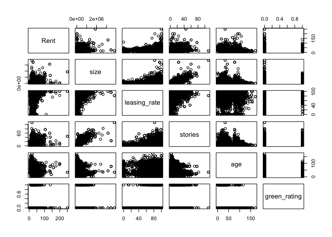

``` r
hist(green$Rent, breaks = 20, xlab = 'Rent ($/sqft/year)')
```

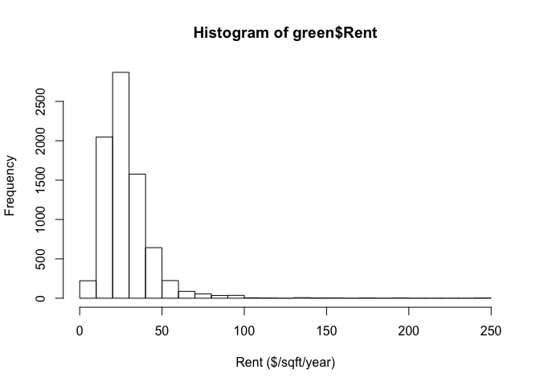

``` r
plot(Rent~size, data = green, pch = 20, cex = .5)
points(green_only$size, green_only$Rent, col = 'green', pch = 20, cex = .5)
```

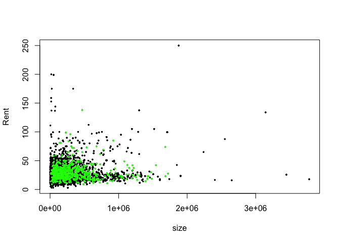 Using this histogram, we can see that there are some observations with very large rent. Let's take a closer look at those observations.

``` r
bigrent = subset(green, green$Rent > 100)
subset(green, green$cluster == 1230)
```

    ##      CS_PropertyID cluster    size empl_gr   Rent leasing_rate stories age
    ## 7842        157078    1230  922027    1.15  85.00        99.67      45  38
    ## 7843        114340    1230   63162    1.15  35.00        92.08      16  80
    ## 7844        158119    1230   61200    1.15  36.00       100.00      12  85
    ## 7845        157599    1230  136000    1.15  38.00        99.23      18  81
    ## 7846         41350    1230  140772    1.15  40.00        98.57      26  86
    ## 7847        158082    1230   47485    1.15  40.00        97.16      12  95
    ## 7848        157656    1230   72000    1.15  42.00        83.76      17  92
    ## 7849        157756    1230   77572    1.15  42.00        78.92      16  92
    ## 7850        160860    1230   82579    1.15  43.87        96.04      13  44
    ## 7851         41359    1230  130200    1.15  44.00        97.70      18  97
    ## 7852        157524    1230  119862    1.15  45.00       100.00      21  78
    ## 7853        157678    1230  100000    1.15  45.00       100.00      16  79
    ## 7854        157974    1230   48000    1.15  45.00        90.63      12  93
    ## 7855        157724    1230  115422    1.15  46.09        86.07      16  81
    ## 7856        157480    1230   58000    1.15  48.00        92.84      21  82
    ## 7857        157718    1230  173444    1.15  49.00        83.83      20  95
    ## 7858        157420    1230  364000    1.15  50.00        98.46      22  52
    ## 7859        157624    1230  212500    1.15  50.00        99.15      17  83
    ## 7860        157777    1230  150000    1.15  50.55        82.00      15  83
    ## 7861        157862    1230   80000    1.15  51.12        96.47      12  96
    ## 7862        158149    1230   48000    1.15  52.00        96.88      12  96
    ## 7863        157437    1230  145000    1.15  52.44        94.21      23  91
    ## 7864        157752    1230  107566    1.15  52.76       100.00      16  86
    ## 7865        157484    1230  126195    1.15  53.00       100.00      21  91
    ## 7866        157388    1230  250000    1.15  54.49        98.54      24  42
    ## 7867          2639    1230   77874    1.15  55.00        98.89      19  20
    ## 7868        157570    1230  292000    1.15  58.00        98.87      18  90
    ## 7869        157424    1230  359000    1.15  58.72        93.20      22  87
    ## 7870        157198    1230  470563    1.15  59.00        99.02      34  78
    ## 7871        157891    1230  179908    1.15  61.87        97.89      12  87
    ## 7872        157407    1230  177400    1.15  62.00        82.12      23  17
    ## 7873        157106    1230  382269    1.15  62.53        93.81      42  76
    ## 7874        123217    1230  185000    1.15  63.24        95.85      14  85
    ## 7875        158136    1230   63775    1.15  65.00        92.48      20 101
    ## 7876        157549    1230  225000    1.15  66.41        93.39      20  52
    ## 7877        157241    1230  638566    1.15  66.81        92.14      31  81
    ## 7878        157226    1230  877138    1.15  67.00        97.80      32  80
    ## 7879        157486    1230  196034    1.15  68.00        84.25      20  45
    ## 7880        157138    1230  459566    1.15  72.00        98.12      39  78
    ## 7881        157215    1230  501358    1.15  79.53        95.26      33  36
    ## 7882        157159    1230  430000    1.15  80.69        98.95      38  80
    ## 7883         52969    1230  706601    1.15  85.00        98.57      21  68
    ## 7884        157088    1230 1172383    1.15  86.29        84.74      44  18
    ## 7885        157104    1230 1034338    1.15  95.00        90.88      42  35
    ## 7886        157452    1230  680280    1.15  97.67        99.34      21  55
    ## 7887        157562    1230  135150    1.15 100.00       100.00      19  80
    ## 7888        157053    1230 1518000    1.15 105.00        97.71      49  36
    ## 7889        664909    1230    4320    1.15 111.11         0.00       4 107
    ## 7890        157117    1230 1300000    1.15 137.51       100.00      41  35
    ## 7891        158379    1230   16140    1.15 152.73        75.22       8  90
    ## 7892         52316    1230   15726    1.15 158.92       100.00       6  67
    ## 7893        158124    1230   51300    1.15 198.99       100.00      12  91
    ## 7894        157086    1230 1876972    1.15 250.00        99.84      45  34
    ##      renovated class_a class_b LEED Energystar green_rating net amenities
    ## 7842         0       1       0    0          1            1   0         0
    ## 7843         0       0       0    0          0            0   0         0
    ## 7844         0       0       1    0          0            0   0         0
    ## 7845         0       0       0    0          0            0   0         0
    ## 7846         0       0       1    0          0            0   0         0
    ## 7847         0       0       1    0          0            0   0         0
    ## 7848         0       0       0    0          0            0   0         0
    ## 7849         0       0       1    0          0            0   0         0
    ## 7850         0       0       1    0          0            0   1         0
    ## 7851         0       0       1    0          0            0   0         0
    ## 7852         0       0       1    0          0            0   0         0
    ## 7853         0       0       1    0          0            0   0         0
    ## 7854         0       0       1    0          0            0   0         0
    ## 7855         0       0       0    0          0            0   0         0
    ## 7856         1       0       1    0          0            0   0         0
    ## 7857         0       0       1    0          0            0   0         0
    ## 7858         0       0       1    0          0            0   0         1
    ## 7859         0       0       1    0          0            0   0         1
    ## 7860         0       0       1    0          0            0   0         0
    ## 7861         0       0       0    0          0            0   0         0
    ## 7862         0       0       1    0          0            0   0         0
    ## 7863         0       0       1    0          0            0   0         0
    ## 7864         0       0       1    0          0            0   0         0
    ## 7865         0       0       1    0          0            0   0         1
    ## 7866         0       1       0    0          0            0   0         0
    ## 7867         0       1       0    0          0            0   0         0
    ## 7868         0       0       1    0          0            0   0         0
    ## 7869         0       0       1    0          0            0   0         1
    ## 7870         1       1       0    0          0            0   0         1
    ## 7871         0       0       1    0          0            0   0         0
    ## 7872         0       1       0    0          0            0   0         1
    ## 7873         0       1       0    0          0            0   0         0
    ## 7874         0       0       1    0          0            0   0         0
    ## 7875         0       1       0    0          0            0   0         0
    ## 7876         0       1       0    0          0            0   1         0
    ## 7877         0       0       1    0          0            0   0         1
    ## 7878         0       0       1    0          0            0   0         1
    ## 7879         0       1       0    0          0            0   0         1
    ## 7880         0       1       0    0          0            0   1         1
    ## 7881         0       1       0    0          0            0   0         1
    ## 7882         0       1       0    0          0            0   1         1
    ## 7883         0       1       0    0          0            0   0         0
    ## 7884         0       1       0    0          0            0   0         1
    ## 7885         0       1       0    0          0            0   0         1
    ## 7886         1       1       0    0          0            0   0         1
    ## 7887         0       0       1    0          0            0   0         0
    ## 7888         1       1       0    0          0            0   0         1
    ## 7889         0       0       0    0          0            0   0         0
    ## 7890         0       1       0    0          0            0   0         0
    ## 7891         1       0       0    0          0            0   0         0
    ## 7892         0       0       0    0          0            0   0         0
    ## 7893         0       0       1    0          0            0   0         0
    ## 7894         1       1       0    0          0            0   0         1
    ##      cd_total_07 hd_total07 total_dd_07 Precipitation  Gas_Costs
    ## 7842        1299       4796        6095         48.35 0.01180000
    ## 7843        1299       4796        6095         48.35 0.01175716
    ## 7844        1299       4796        6095         48.35 0.01175716
    ## 7845        1299       4796        6095         48.35 0.01175716
    ## 7846        1299       4796        6095         48.35 0.01175716
    ## 7847        1299       4796        6095         48.35 0.01175716
    ## 7848        1299       4796        6095         48.35 0.01175716
    ## 7849        1299       4796        6095         48.35 0.01175716
    ## 7850        1299       4796        6095         48.35 0.01175716
    ## 7851        1299       4796        6095         48.35 0.01175716
    ## 7852        1299       4796        6095         48.35 0.01175716
    ## 7853        1299       4796        6095         48.35 0.01175716
    ## 7854        1299       4796        6095         48.35 0.01175716
    ## 7855        1299       4796        6095         48.35 0.01175716
    ## 7856        1299       4796        6095         48.35 0.01175716
    ## 7857        1299       4796        6095         48.35 0.01175716
    ## 7858        1299       4796        6095         48.35 0.01175716
    ## 7859        1299       4796        6095         48.35 0.01175716
    ## 7860        1299       4796        6095         48.35 0.01175716
    ## 7861        1299       4796        6095         48.35 0.01175716
    ## 7862        1299       4796        6095         48.35 0.01175716
    ## 7863        1299       4796        6095         48.35 0.01175716
    ## 7864        1299       4796        6095         48.35 0.01175716
    ## 7865        1299       4796        6095         48.35 0.01175716
    ## 7866        1299       4796        6095         48.35 0.01175716
    ## 7867        1299       4796        6095         48.35 0.01175716
    ## 7868        1299       4796        6095         48.35 0.01175716
    ## 7869        1299       4796        6095         48.35 0.01175716
    ## 7870        1299       4796        6095         48.35 0.01175716
    ## 7871        1299       4796        6095         48.35 0.01175716
    ## 7872        1299       4796        6095         48.35 0.01175716
    ## 7873        1299       4796        6095         48.35 0.01175716
    ## 7874        1299       4796        6095         48.35 0.01175716
    ## 7875        1299       4796        6095         48.35 0.01175716
    ## 7876        1299       4796        6095         48.35 0.01175716
    ## 7877        1299       4796        6095         48.35 0.01175716
    ## 7878        1299       4796        6095         48.35 0.01175716
    ## 7879        1299       4796        6095         48.35 0.01175716
    ## 7880        1299       4796        6095         48.35 0.01175716
    ## 7881        1299       4796        6095         48.35 0.01175716
    ## 7882        1299       4796        6095         48.35 0.01175716
    ## 7883        1299       4796        6095         48.35 0.01175716
    ## 7884        1299       4796        6095         48.35 0.01175716
    ## 7885        1299       4796        6095         48.35 0.01175716
    ## 7886        1299       4796        6095         48.35 0.01175716
    ## 7887        1299       4796        6095         48.35 0.01175716
    ## 7888        1299       4796        6095         48.35 0.01175716
    ## 7889        1299       4796        6095         48.35 0.01175716
    ## 7890        1299       4796        6095         48.35 0.01175716
    ## 7891        1299       4796        6095         48.35 0.01175716
    ## 7892        1299       4796        6095         48.35 0.01175716
    ## 7893        1299       4796        6095         48.35 0.01175716
    ## 7894        1299       4796        6095         48.35 0.01175716
    ##      Electricity_Costs cluster_rent
    ## 7842        0.04550000        58.72
    ## 7843        0.04545721        58.72
    ## 7844        0.04545721        58.72
    ## 7845        0.04545721        58.72
    ## 7846        0.04545721        58.72
    ## 7847        0.04545721        58.72
    ## 7848        0.04545721        58.72
    ## 7849        0.04545721        58.72
    ## 7850        0.04545721        58.72
    ## 7851        0.04545721        58.72
    ## 7852        0.04545721        58.72
    ## 7853        0.04545721        58.72
    ## 7854        0.04545721        58.72
    ## 7855        0.04545721        58.72
    ## 7856        0.04545721        58.72
    ## 7857        0.04545721        58.72
    ## 7858        0.04545721        58.72
    ## 7859        0.04545721        58.72
    ## 7860        0.04545721        58.72
    ## 7861        0.04545721        58.72
    ## 7862        0.04545721        58.72
    ## 7863        0.04545721        58.72
    ## 7864        0.04545721        58.72
    ## 7865        0.04545721        58.72
    ## 7866        0.04545721        58.72
    ## 7867        0.04545721        58.72
    ## 7868        0.04545721        58.72
    ## 7869        0.04545721        58.72
    ## 7870        0.04545721        58.72
    ## 7871        0.04545721        58.72
    ## 7872        0.04545721        58.72
    ## 7873        0.04545721        58.72
    ## 7874        0.04545721        58.72
    ## 7875        0.04545721        58.72
    ## 7876        0.04545721        58.72
    ## 7877        0.04545721        58.72
    ## 7878        0.04545721        58.72
    ## 7879        0.04545721        58.72
    ## 7880        0.04545721        58.72
    ## 7881        0.04545721        58.72
    ## 7882        0.04545721        58.72
    ## 7883        0.04545721        58.72
    ## 7884        0.04545721        58.72
    ## 7885        0.04545721        58.72
    ## 7886        0.04545721        58.72
    ## 7887        0.04545721        58.72
    ## 7888        0.04545721        58.72
    ## 7889        0.04545721        58.72
    ## 7890        0.04545721        58.72
    ## 7891        0.04545721        58.72
    ## 7892        0.04545721        58.72
    ## 7893        0.04545721        58.72
    ## 7894        0.04545721        58.72

Our approach to solving the problem
===================================

In order to answer this question, we first fit a linear model of the size of green buildings to their number of stories. Using this model, we predicted that our 15-story building will be about 320,000 sq ft in area (as shown by the intersect of the three lines).

``` r
size.fit = lm(size~stories, data = green_only)
y = predict(size.fit, data.frame(stories = 15))
plot(green_only$stories, green_only$size, ylab = 'Rent per sq ft per year', xlab = 'Size in sq ft')
abline(size.fit$coefficients[1], size.fit$coefficients[2], col = "green", lwd = 3)
abline(y,0, col = 'green')
abline(v=15, col = 'green')
points(15, y, cex = 1.5, pch = 20, col = 'purple')
```

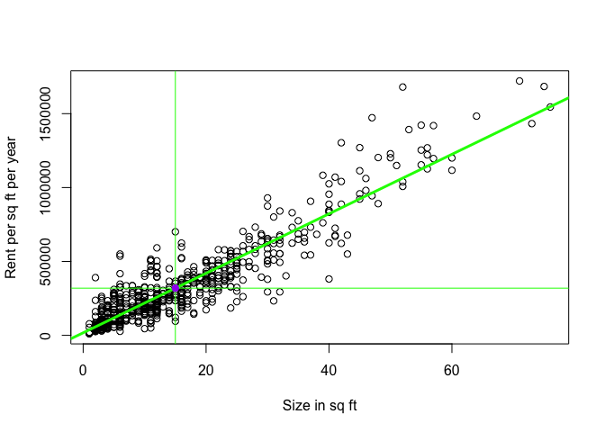

We will use this estimate to deterime the additional rent (which will be attributed to whether or not the building is classified as 'green') per square foot needed to pay off the additional $5,000,000 capital expense.

To do this, we will attempt to isolate the effect of a green rating on rent by fitting a linear model that regresses rent against certain variables we select from our data set. The coefficient of the as.factor(green\_rating)1 will show how much rent increases (or decreases) for green buildings.

``` r
rent.fit = lm(Rent~+as.factor(green_rating)+as.factor(class_a)+as.factor(class_b)+size, data = green)
summary(rent.fit)
```

    ## 
    ## Call:
    ## lm(formula = Rent ~ +as.factor(green_rating) + as.factor(class_a) + 
    ##     as.factor(class_b) + size, data = green)
    ## 
    ## Residuals:
    ##     Min      1Q  Median      3Q     Max 
    ## -23.766  -9.002  -2.736   5.857 213.852 
    ## 
    ## Coefficients:
    ##                            Estimate Std. Error t value Pr(>|t|)    
    ## (Intercept)               2.379e+01  4.444e-01  53.543  < 2e-16 ***
    ## as.factor(green_rating)1 -1.240e+00  6.114e-01  -2.028   0.0426 *  
    ## as.factor(class_a)1       7.761e+00  5.672e-01  13.683  < 2e-16 ***
    ## as.factor(class_b)1       2.319e+00  5.095e-01   4.550 5.44e-06 ***
    ## size                      2.447e-06  6.279e-07   3.898 9.77e-05 ***
    ## ---
    ## Signif. codes:  0 '***' 0.001 '**' 0.01 '*' 0.05 '.' 0.1 ' ' 1
    ## 
    ## Residual standard error: 14.73 on 7815 degrees of freedom
    ## Multiple R-squared:  0.04941,    Adjusted R-squared:  0.04892 
    ## F-statistic: 101.6 on 4 and 7815 DF,  p-value: < 2.2e-16

After experimenting with nearly a dozen different models, we came up with the one above. Surprisingly, this model (among many others) indicates that the green buildings actually charge less rent! However, based on the p-value for this variable, this figure may or may not be considered significant. This means that the classification as 'green' or 'nongreen' may not actually affect the rent charged.

There are, however, other ways in which green buildings create value for the owner. Specifically, we are referring to cost savings on utility bills. One way this analysis could be improved is if there was some way to quantify this (perhaps using the total\_dd\_07 or the gas/electric costs columns) and consider the savings against the capital costs.

Another way we could improve our would be to perform a comps analysis. If we could determine how comparable each cluster was to the area we are interested in for our building, we could examine our data in a more refined context.

What we think the excel guru did right/wrong
============================================

1.  We believe it was incorrect to remove the buildings with less than 10% occupancy from the data set. While it could be that something 'weird' going on, as the excel guru said, there are a number of other possible explanations for this. For example, they could be new buildings that are in the process of leasing out office space, or they could have been built in markets that no longer have a need for more space. An example of the latter could be the city of Houston after the oil prices crashed in 2014. Before 2014 the oil and gas prices were sky-high and many people thought they would remain there for a long time. Because of this sentiment, a great deal of investment was made. However, when prices fell and people realized a recovery would not come as quickly as they had hoped, many of these investments were cancelled. one of the many outcomes was a large surplus of office space. While this isn't 'business as usual,' it is a real business situation that should be considered.

2.  Another error in judgment is that he assumed that rents were affected by whether or not the building is considered green. As we came to realize from fitting numerous models, the p-value for the green\_rating variable was too high. While it is true that the medain rent charged by green buildings is higher than that of non-green ones, it could be attributed to other factors. For example, green buildings tend to be newer and fancier than conventional ones - as seen in the charts below.

``` r
library(lattice)
par(mfrow=c(1,2))
histogram(nongreen$age, main = 'Age of nongreen Buildings', xlab = 'age', xlim = range(1:150), breaks = 20, ylim = range(1:45))
```

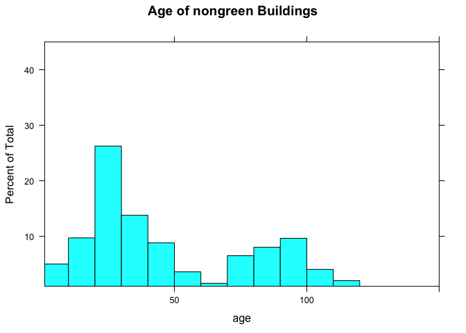

``` r
histogram(green_only$age, main = 'Age of GREEN Buildings', xlab = 'age', xlim = range(1:150), breaks = 10, ylim = range(1:45))
```

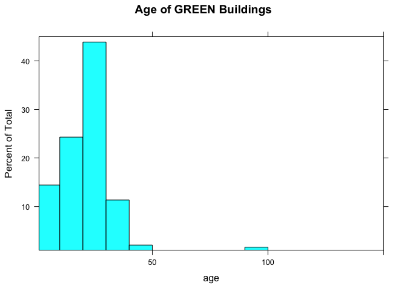

``` r
classa.freq = table(nongreen$class_a)
gclassa.freq = table(green_only$class_a)
barplot(classa.freq/sum(classa.freq), main = 'Fancy nongreen Buildings', ylim = range(0,.8), ylab = 'Fraction of all Buildings')
barplot(gclassa.freq/sum(gclassa.freq), main = 'Fancy GREEN Buildings', ylim = range(0,.8), ylab = 'Fraction of GREEN Buildings')
```

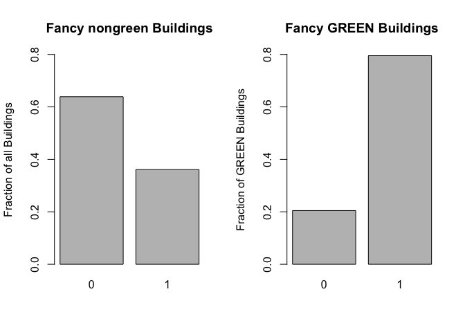

1.  Otherwise, we agree with his general approach. Using median rent instead of mean rent is an acceptable approach because outliers do not throw off the calculation. Also, comparing an expected additional rent that could be charged with green buildings to the added cost of consturction is correctly matching costs with expected revenues.

Bootstrapping
-------------

Our answer outlines each portfolio in separate chunks of code before presenting a summary of all results. In each portfolio, we estimated the 4-week value at risk by utilizing bootstrap resampling.

Portfolio 1: Equal split across given ETFs
==========================================

Our first portfolio considers an equal split across five classes of ETFs: US domestic equities (SPY), US Treasury bonds (TLT), investment-grade corporate bonds (LQD), emerging-market equities (EEM), and real estate (VNQ).

``` r
set.seed(123)  # for reproducibility of results
library(foreach)
library(quantmod)
```

    ## Loading required package: xts

    ## Loading required package: zoo

    ## 
    ## Attaching package: 'zoo'

    ## The following objects are masked from 'package:base':
    ## 
    ##     as.Date, as.Date.numeric

    ## 
    ## Attaching package: 'xts'

    ## The following objects are masked from 'package:dplyr':
    ## 
    ##     first, last

    ## Loading required package: TTR

    ## Version 0.4-0 included new data defaults. See ?getSymbols.

``` r
library(mosaic)
```

    ## Loading required package: ggformula

    ## Loading required package: ggplot2

    ## 
    ## New to ggformula?  Try the tutorials: 
    ##  learnr::run_tutorial("introduction", package = "ggformula")
    ##  learnr::run_tutorial("refining", package = "ggformula")

    ## Loading required package: mosaicData

    ## 
    ## The 'mosaic' package masks several functions from core packages in order to add 
    ## additional features.  The original behavior of these functions should not be affected by this.
    ## 
    ## Note: If you use the Matrix package, be sure to load it BEFORE loading mosaic.

    ## 
    ## Attaching package: 'mosaic'

    ## The following objects are masked from 'package:dplyr':
    ## 
    ##     count, do, tally

    ## The following objects are masked from 'package:stats':
    ## 
    ##     binom.test, cor, cor.test, cov, fivenum, IQR, median,
    ##     prop.test, quantile, sd, t.test, var

    ## The following objects are masked from 'package:base':
    ## 
    ##     max, mean, min, prod, range, sample, sum

``` r
assets = c("SPY","TLT","LQD","EEM","VNQ")
prices = getSymbols(assets, from = "2006-01-01")
```

    ## 'getSymbols' currently uses auto.assign=TRUE by default, but will
    ## use auto.assign=FALSE in 0.5-0. You will still be able to use
    ## 'loadSymbols' to automatically load data. getOption("getSymbols.env")
    ## and getOption("getSymbols.auto.assign") will still be checked for
    ## alternate defaults.
    ## 
    ## This message is shown once per session and may be disabled by setting 
    ## options("getSymbols.warning4.0"=FALSE). See ?getSymbols for details.

    ## 
    ## WARNING: There have been significant changes to Yahoo Finance data.
    ## Please see the Warning section of '?getSymbols.yahoo' for details.
    ## 
    ## This message is shown once per session and may be disabled by setting
    ## options("getSymbols.yahoo.warning"=FALSE).

    ## Warning: LQD contains missing values. Some functions will not work if
    ## objects contain missing values in the middle of the series. Consider using
    ## na.omit(), na.approx(), na.fill(), etc to remove or replace them.

``` r
for(ticker in assets) {
  expr = paste0(ticker, "a = adjustOHLC(", ticker, ")")
  eval(parse(text=expr))
}

# Plot close-to-close changes
par(mfrow=c(3,2))
plot(ClCl(SPYa))
hist(ClCl(SPYa), breaks=50) 
plot(ClCl(TLTa))
hist(ClCl(TLTa), breaks=50)
plot(ClCl(LQDa))
hist(ClCl(LQDa), breaks=50)
```

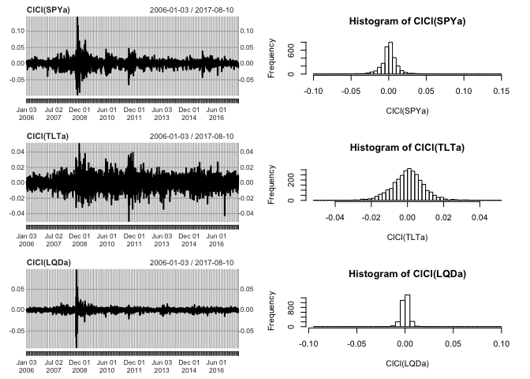

``` r
plot(ClCl(EEMa))
hist(ClCl(EEMa), breaks=50)
plot(ClCl(VNQa))
hist(ClCl(VNQa), breaks=50)

# Combine all the returns in a matrix
all_returns = cbind(    
  ClCl(SPYa),
  ClCl(TLTa),
  ClCl(LQDa),
  ClCl(EEMa),
  ClCl(VNQa)
)
all_returns = as.matrix(na.omit(all_returns))

# Simulate a random day
return.today = resample(all_returns, 1, orig.ids=FALSE)

# Looping over 4 trading weeks (n_days = 20)
initial_wealth = 100000
sim1 = foreach(i=1:5000, .combine='rbind') %do% {
  total_wealth = initial_wealth
  weights = c(0.2, 0.2, 0.2, 0.2, 0.2)
  holdings = weights * total_wealth
  n_days = 20
  wealthtracker = rep(0, n_days)
  for(today in 1:n_days) {
    return.today = resample(all_returns, 1, orig.ids=FALSE)
    holdings = holdings*(1 + return.today)
    total_wealth = sum(holdings)
    wealthtracker[today] = total_wealth
    holdings = weights * total_wealth # rebalance
  }
  wealthtracker
}

par(mfrow=c(2,1))
```

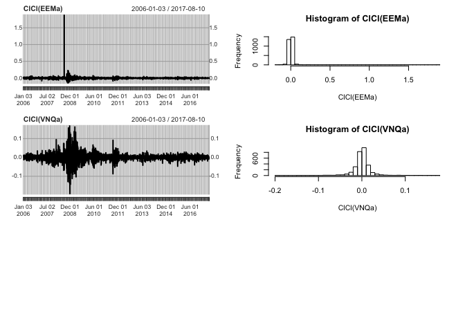

``` r
hist(sim1[,n_days], 30)

# Profit/loss
mean(sim1[,n_days])
```

    ## [1] 100981.4

``` r
hist(sim1[,n_days]- initial_wealth, breaks=30)
```

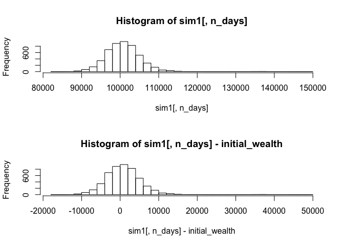

``` r
# Calculate 5% value at risk  
quantile(sim1[,n_days], 0.05) - initial_wealth    
```

    ##        5% 
    ## -5972.402

These five asset classes' risk and return properties can be interpreted by each ClCl plot and histogram. The US domestic equities (SPY) appears to have a higher tail on the right side of its histogram, suggesting a higher potential for return than the risk it poses. Close-to-close volatility in this ETF looks generally to stay within +/- 0.05. The US Treasury bonds asset (TLT) shows a more normal distribution for ClCl return versus risk, and seems to be less volatile on average than SPY. The investment-grade corporate bonds (LQD) show low volatility and not a lot of return or risk potential. Emerging-market equities (EEM) doesn't appear to be as volatile and has a wide-right histogram tail from 2008. The real estate asset (VNQ) seems to have less promise for return than in past years.

Portfolio 2: Safe ETFs
======================

Next, we created a portfolio using three different ETFs established to be safe choices. These ETFs include the SPDR Gold Trust (GLD), which protects against "tail risks" in the market, the minimum-volatility iShares Edged MSCI Min Vol EAFE ETF (EFAV), and the generally "risk-free" iShares Core US Aggregate Bond ETF (AGG). We set an even split between these three ETFs.

``` r
set.seed(123)
library(foreach)
library(quantmod)
library(mosaic)

safe = c("GLD","EFAV","AGG") 
safeprices = getSymbols(safe, from = "2006-01-01")

for(ticker in safe) {
  expr = paste0(ticker, "a = adjustOHLC(", ticker, ")")
  eval(parse(text=expr))
}

# Plot close-to-close changes
par(mfrow=c(3,2))
plot(ClCl(GLDa))
hist(ClCl(GLDa), breaks=50) 
plot(ClCl(EFAVa))
hist(ClCl(EFAVa), breaks=50)
plot(ClCl(AGGa))
hist(ClCl(AGGa), breaks=50)
```

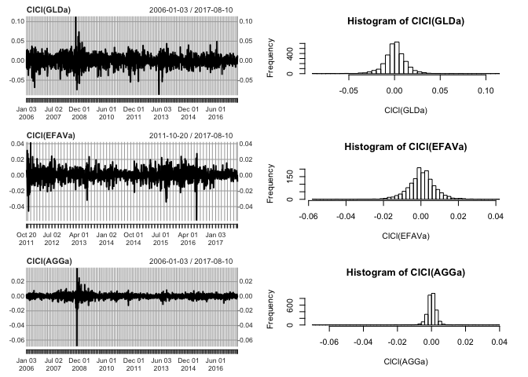

``` r
# Combine all the returns in a matrix
all_returns = cbind(    
  ClCl(GLDa),
  ClCl(EFAVa),
  ClCl(AGGa)
)
all_returns = as.matrix(na.omit(all_returns))

# Simulate a random day
return.today = resample(all_returns, 1, orig.ids=FALSE)

# Loop over 4 trading weeks
initial_wealth = 100000
sim1 = foreach(i=1:5000, .combine='rbind') %do% {
  total_wealth = initial_wealth
  weights = c(1/3, 1/3, 1/3)
  holdings = weights * total_wealth
  n_days = 20
  wealthtracker = rep(0, n_days)
  for(today in 1:n_days) {
    return.today = resample(all_returns, 1, orig.ids=FALSE)
    holdings = holdings*(1 + return.today)
    total_wealth = sum(holdings)
    wealthtracker[today] = total_wealth
    holdings = weights * total_wealth  # rebalance
  }
  wealthtracker
}

par(mfrow=c(2,1))
hist(sim1[,n_days], 30)

# Profit/loss
mean(sim1[,n_days])
```

    ## [1] 100194

``` r
hist(sim1[,n_days]- initial_wealth, breaks=30)
```

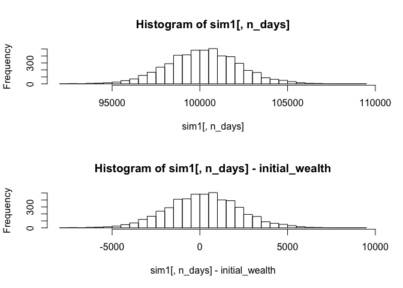

``` r
# Calculate 5% value at risk 
quantile(sim1[,n_days], 0.05) - initial_wealth 
```

    ##        5% 
    ## -3215.453

Portfolio 3: Risky ETFs
=======================

Finally, we built our most aggressive portfolio from 2 ETFs that have been established to be very volatile in nature and by design. These choices included a volatile stock ETF, Direxion Daily Gold Miners Bear 3x ETF (DUST), as well as UVXY, an ETF titled ProShares Ultra VIX Short-term Futures Fund that invests in volatility (or the "fear index") rather than stocks. We set an even split between these two ETFs.

``` r
set.seed(123)
library(foreach)
library(quantmod)
library(mosaic)

risky = c("DUST","UVXY")
riskyprices = getSymbols(risky, from = "2006-01-01")

for(ticker in risky) {
  expr = paste0(ticker, "a = adjustOHLC(", ticker, ")")
  eval(parse(text=expr))
}

# Plot close-to-close changes
par(mfrow=c(2,2))
plot(ClCl(DUSTa))
hist(ClCl(DUSTa), breaks=50) 
plot(ClCl(UVXYa))
hist(ClCl(UVXYa), breaks=50)
```

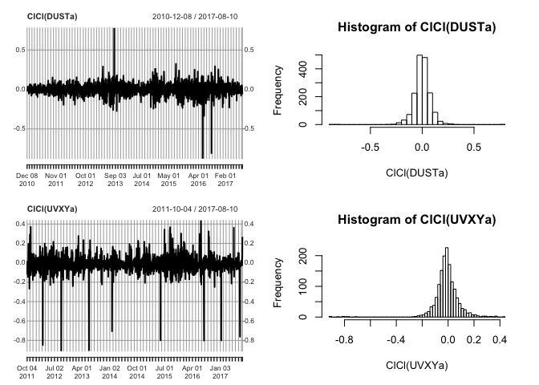

``` r
# Combine all the returns in a matrix
all_returns = cbind(    
  ClCl(DUSTa),
  ClCl(UVXYa)
)
all_returns = as.matrix(na.omit(all_returns))

# Simulate a random day
return.today = resample(all_returns, 1, orig.ids=FALSE)

# Loop over 4 trading weeks:
initial_wealth = 100000
sim1 = foreach(i=1:5000, .combine='rbind') %do% {
  total_wealth = initial_wealth
  weights = c(0.5, 0.5)
  holdings = weights * total_wealth
  n_days = 20
  wealthtracker = rep(0, n_days)
  for(today in 1:n_days) {
    return.today = resample(all_returns, 1, orig.ids=FALSE)
    holdings = holdings + holdings*return.today
    total_wealth = sum(holdings)
    wealthtracker[today] = total_wealth
    holdings = weights * total_wealth  # rebalance
  }
  wealthtracker
}

par(mfrow=c(2,1))
hist(sim1[,n_days], 30)

# Profit/loss
mean(sim1[,n_days])
```

    ## [1] 90052.62

``` r
hist(sim1[,n_days]- initial_wealth, breaks=30)
```

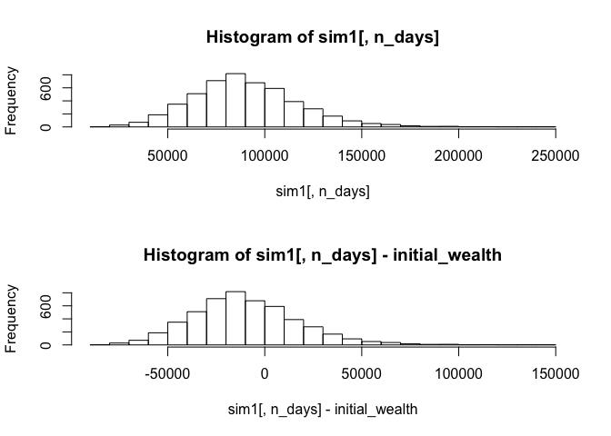

``` r
# Calculate 5% value at risk 
quantile(sim1[,n_days], 0.05) - initial_wealth 
```

    ##        5% 
    ## -51374.87

Summary
=======

5% value at risk for each portfolio: \* Portfolio 1: -6186.33 \* Portfolio 2 (safe): -3215.45 \* Portfolio 3 (aggressive): -53029.15

Looking at each histogram of frequency vs. profit/loss for the simulation over 4 trading weeks, we can see a good representation of what we expected when building our portfolios. The first portfolio with the even split across the 5 given ETFs shows a profit/loss distribuition after subtracting the initial $100,000 of around $10,000 above and below 0. The second portfolio's safety is represented in this profit/loss range shrinking to around +/- $5000. The risky portfolio, on the other hand, has a profit/loss distribution from below -$50,000 to $50,000, involving a great deal of volatility in just 20 trading days. The 5% values at risk also confirm the respective safety and risk built into Portfolios 2 and 3, with a much higher value for portfolio 3 and a smaller value than portfolio 1 for the third portfolio.

Market Segmentation
-------------------

``` r
library(ggplot2)
library(LICORS)  # for kmeans++
library(foreach)
library(mosaic)

social = read.csv('http://raw.githubusercontent.com/jgscott/STA380/master/data/social_marketing.csv', header=TRUE)
head(social[,-1],5)
```

    ##   chatter current_events travel photo_sharing uncategorized tv_film
    ## 1       2              0      2             2             2       1
    ## 2       3              3      2             1             1       1
    ## 3       6              3      4             3             1       5
    ## 4       1              5      2             2             0       1
    ## 5       5              2      0             6             1       0
    ##   sports_fandom politics food family home_and_garden music news
    ## 1             1        0    4      1               2     0    0
    ## 2             4        1    2      2               1     0    0
    ## 3             0        2    1      1               1     1    1
    ## 4             0        1    0      1               0     0    0
    ## 5             0        2    0      1               0     0    0
    ##   online_gaming shopping health_nutrition college_uni sports_playing
    ## 1             0        1               17           0              2
    ## 2             0        0                0           0              1
    ## 3             0        2                0           0              0
    ## 4             0        0                0           1              0
    ## 5             3        2                0           4              0
    ##   cooking eco computers business outdoors crafts automotive art religion
    ## 1       5   1         1        0        2      1          0   0        1
    ## 2       0   0         0        1        0      2          0   0        0
    ## 3       2   1         0        0        0      2          0   8        0
    ## 4       0   0         0        1        0      3          0   2        0
    ## 5       1   0         1        0        1      0          0   0        0
    ##   beauty parenting dating school personal_fitness fashion small_business
    ## 1      0         1      1      0               11       0              0
    ## 2      0         0      1      4                0       0              0
    ## 3      1         0      1      0                0       1              0
    ## 4      1         0      0      0                0       0              0
    ## 5      0         0      0      0                0       0              1
    ##   spam adult
    ## 1    0     0
    ## 2    0     0
    ## 3    0     0
    ## 4    0     0
    ## 5    0     0

``` r
#scale the data
X = social[,-1]
X = X/rowSums(X)
```

We decided to scale the data according to their row sums because we want all users' interests to be equally weighted regardless of their overall level of twitter usage.

Kmeans method:
==============

``` r
#test various k values
CH_list = {}
kval = c(2,4,6,10,15)
for (i in kval){
  # Using kmeans++ initialization
  cluster = kmeanspp(X, k=i, nstart=25)
  W = cluster$tot.withinss
  B = cluster$betweenss
  nk = (nrow(social)-i)/(i-1)
  val = (B/W)*nk
  CH_list = c(CH_list,val)
  cat(c(i," "))
}
```

    ## 2  4  6  10  15

``` r
#plot CH index againt k value to find best k
plot(kval,CH_list)
```


The plot of CH index against K value, we decided that the best k value is 6. The max CH value occurs when k = 2, but since our dataset is so large, it makes sense to split into more than 2 clusters. At a k value of 6, the CH index is high, but we are clustering the data into smaller subsets, so we chose to work with k = 6 clusters.

``` r
#run kmeans to cluster the data
set.seed(11)
finalcluster = kmeanspp(X, k=6, nstart=25)

finalcluster$size
```

    ## [1]  789 2069  610 1946 1349 1119

``` r
finalcluster$centers[2,]
```

    ##          chatter   current_events           travel    photo_sharing 
    ##     2.339924e-01     5.633070e-02     3.593937e-02     1.175645e-01 
    ##    uncategorized          tv_film    sports_fandom         politics 
    ##     2.567276e-02     2.362182e-02     2.519554e-02     2.949261e-02 
    ##             food           family  home_and_garden            music 
    ##     1.902771e-02     2.045199e-02     1.568317e-02     1.843638e-02 
    ##             news    online_gaming         shopping health_nutrition 
    ##     1.406586e-02     1.523592e-02     6.777381e-02     2.145805e-02 
    ##      college_uni   sports_playing          cooking              eco 
    ##     2.266085e-02     1.401526e-02     1.938834e-02     1.489493e-02 
    ##        computers         business         outdoors           crafts 
    ##     1.402210e-02     1.265952e-02     9.474187e-03     1.268036e-02 
    ##       automotive              art         religion           beauty 
    ##     1.886850e-02     1.049689e-02     1.102066e-02     9.606155e-03 
    ##        parenting           dating           school personal_fitness 
    ##     1.236559e-02     1.691043e-02     1.500503e-02     1.719061e-02 
    ##          fashion   small_business             spam            adult 
    ##     1.460953e-02     9.441356e-03     7.020247e-05     4.676975e-03

``` r
finalcluster$centers[4,]
```

    ##          chatter   current_events           travel    photo_sharing 
    ##     0.0816242872     0.0492912467     0.0349430699     0.0434273869 
    ##    uncategorized          tv_film    sports_fandom         politics 
    ##     0.0266437055     0.0447842182     0.0729954519     0.0204538113 
    ##             food           family  home_and_garden            music 
    ##     0.0579891985     0.0335093834     0.0156797854     0.0208438668 
    ##             news    online_gaming         shopping health_nutrition 
    ##     0.0183975036     0.0160780634     0.0237825555     0.0214936595 
    ##      college_uni   sports_playing          cooking              eco 
    ##     0.0288050578     0.0148722498     0.0190312471     0.0130273344 
    ##        computers         business         outdoors           crafts 
    ##     0.0128717928     0.0121358616     0.0133053981     0.0172850646 
    ##       automotive              art         religion           beauty 
    ##     0.0176483138     0.0313111823     0.0579849730     0.0160396928 
    ##        parenting           dating           school personal_fitness 
    ##     0.0437419395     0.0190613783     0.0319351484     0.0166516796 
    ##          fashion   small_business             spam            adult 
    ##     0.0166442516     0.0107877632     0.0003340708     0.0245884068

The largest clusters are clusters 2 and 4, so we can look at the top topics of interest in the clusters to learn about many of the followers. Cluster 2 displays an interest in photo sharing, shopping, current events, and travel. Cluster 4 shows interest in sports fandom, food, and religion. We can use this information to tailor our message in our marketing campaign.

``` r
#plot to show our target influencers
qplot(health_nutrition, food, data=X, color=factor(finalcluster$cluster))
```

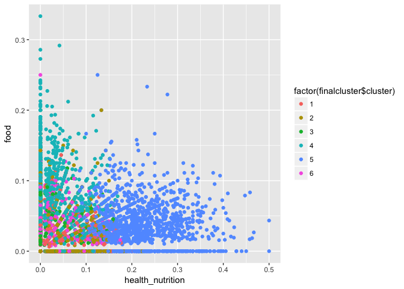

After looking at the 6 clusters, we plotted the clusters against health\_nutrition and food because we determined that these are the topics that most relate to nutrientH2O. We found that groups 4 and 5 show a high level of interest in these topics, so we can find the influencers among these groups to help us campaign about NutrientH2O.

PCA method:
===========

``` r
# PCA
set.seed(12)
PC = prcomp(X, scale=TRUE)
loadings = PC$rotation
scores = PC$x


# Show the top topics associated with each component
o1 = order(loadings[,1], decreasing = TRUE)
colnames(X)[head(o1,6)]
```

    ## [1] "religion"      "sports_fandom" "parenting"     "food"         
    ## [5] "school"        "family"

``` r
colnames(X)[tail(o1,6)]
```

    ## [1] "college_uni"   "fashion"       "cooking"       "shopping"     
    ## [5] "chatter"       "photo_sharing"

``` r
o2 = order(loadings[,2], decreasing = TRUE)
colnames(X)[head(o2,6)]
```

    ## [1] "chatter"        "politics"       "travel"         "shopping"      
    ## [5] "automotive"     "current_events"

``` r
colnames(X)[tail(o2,6)]
```

    ## [1] "beauty"           "fashion"          "cooking"         
    ## [4] "outdoors"         "personal_fitness" "health_nutrition"

``` r
#plot the data on PC1 and PC2
qplot(scores[,1], scores[,2], xlab='Component 1', ylab='Component 2')
```


``` r
#plot all vectors
biplot(PC)
```


Because health\_nutrition is the lowest loading in PC2 and food is high in PC1, we want to target the users whose PC2 is low and PC1 is high. These users are plotted in the bottom region slightly to the right in the biplot shown.
